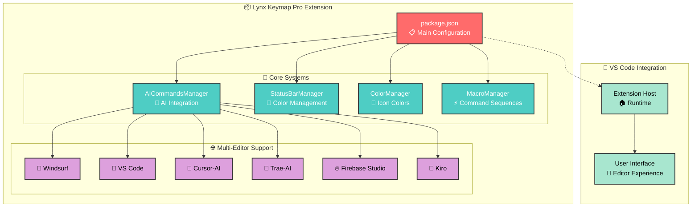

# Lynx Keymap Pro Architecture

## Overview

**Lynx Keymap Pro** standardizes keyboard shortcuts across all code editors, specifically adapted for professional keyboards. It enables developers to use key combinations to access any functionality with precision and consistency, optimizing development workflow with a unified and efficient experience regardless of the editor used.

**Available now**: VS Code • Cursor • Windsurf • Trae.ai • Kiro • Firebase Studio

### Key Value Propositions

- **🎯 Professional Keyboard Optimization**: Tailored shortcuts that maximize compact layout efficiency
- **🌐 Universal Editor Support**: Consistent experience across 6 major code editors
- **🤖 Intelligent AI Integration**: Smart fallback system for AI commands across platforms
- **⚡ Enhanced Productivity**: Streamlined workflows through optimized key combinations
- **🎨 Visual Customization**: Dynamic color management for improved visual feedback
- **🔄 Macro Automation**: Complex command sequences with precise timing control

## Architecture Diagram



## 🎹 Professional Keyboard Layout

> - 🎯 Optimized Keys: Alt, Ctrl, Insert, Delete, Page Up/Down, Function Keys

```
┌─────┬─────┬─────┬─────┬─────┬─────┬─────┬─────┬─────┬─────┬─────┬─────┬─────┬──────────┬─────┐────┐
│ Esc │ F1  │ F2  │ F3  │ F4  │ F5  │ F6  │ F7  │ F8  │ F9  │ F10 │ F11 │ F12 │   Del    │ Ins │ 🛞 │
├─────┼─────┼─────┼─────┼─────┼─────┼─────┼─────┼─────┼─────┼─────┼─────┼─────┼──────────┼─────┤────┤
│  `  │  1  │  2  │  3  │  4  │  5  │  6  │  7  │  8  │  9  │  0  │  -  │  =  │ Backsp   │ End │    │
├─────┴──┬──┴──┬──┴──┬──┴──┬──┴──┬──┴──┬──┴──┬──┴──┬──┴──┬──┴──┬──┴──┬──┴──┬──┴──┬───────┼─────┤────┤
│  Tab   │  Q  │  W  │  E  │  R  │  T  │  Y  │  U  │  I  │  O  │  P  │  [  │  ]  │   \   │ PgUp│    │
├────────┴─┬───┴─┬───┴─┬───┴─┬───┴─┬───┴─┬───┴─┬───┴─┬───┴─┬───┴─┬───┴─┬───┴─┬───┴───────┼─────┤────┤
│   Caps   │  A  │  S  │  D  │  F  │  G  │  H  │  J  │  K  │  L  │  ;  │  '  │   Enter   │ PgDn│    │
├──────────┴──┬──┴──┬──┴──┬──┴──┬──┴──┬──┴──┬──┴──┬──┴──┬──┴──┬──┴──┬──┴──┬──┴───────────┼─────┤────┤
│    Shift    │  Z  │  X  │  C  │  V  │  B  │  N  │  M  │  ,  │  .  │  /  │    Shift     │  ↑  │    │
├────┬────────┼─────┴─┬───┴─────┴─────┴─────┴─────┴─────┴─┬───┴─┬───┴─────┼─────────┬────┼─────┤────┤
│Ctrl│   Win  │  Alt  │                Space              │ Alt │  Fn     │   Ctrl  │ ←  │  ↓  │ →  │
└────┴────────┴───────┴───────────────────────────────────┴─────┴─────────┴─────────┴────┴─────┴────┘
```

## ⚡ Quick Start

1. **Install**: Search "Lynx Keymap Pro" in VS Code Extensions
2. **Activate**: Restart VS Code - shortcuts are automatically active
3. **Test**: Press `Ctrl+1` (Explorer), `Alt+2` (AI Commit), `Ctrl+Alt+PgDn` (Color Toggle)

## Project Structure

```
lynx-keymap-pro/
├── src/
│   ├── extension.js              # Main entry point
│   ├── editor-ui/                # UI components
│   │   ├── status-bar.js         # Status bar colors
│   │   └── icons/
│   │       ├── icon-painter.js   # Icon colors
│   │       └── macros.js         # Macro system
│   └── keymaps/                  # Keyboard mappings
│       ├── ai-keymap-config.js   # AI commands
│       └── ai-keymap-handler.js  # AI execution
├── assets/                       # Resources
├── package.json                  # Extension config
└── README.md                     # Documentation
```

## Key Features

### 🤖 AI Management System

- **Smart Detection**: Automatically detects available AI providers
- **Intelligent Fallback**: Priority-based command execution across editors
- **Universal Commands**: Same shortcuts work in all supported editors

### 🎨 Visual Management

- **Status Bar Colors**: 5-color rotation with smart history (Green, Blue, Orange, Lemon, Red)
- **Icon Colors**: Blue → Green → Default cycle
- **Smart Selection**: Prevents recent color repetition

### ⚡ Macro System

- **Command Sequences**: Execute multiple commands with precise timing
- **Execution Lock**: Prevents concurrent macro conflicts
- **Error Recovery**: Robust handling of failed commands

## Keyboard Shortcuts

| Category        | Shortcut         | Action                             |
| --------------- | ---------------- | ---------------------------------- |
| **Navigation**  | `Ctrl+1/2/3`     | Explorer/Source Control/Extensions |
|                 | `Ctrl+Tab`       | Toggle sidebar                     |
|                 | `Alt+C/V`        | New file/folder                    |
| **Git**         | `Alt+1/3`        | Stage/Unstage all                  |
|                 | `Alt+2`          | AI commit message                  |
|                 | `Alt+4`          | Git pull                           |
|                 | `Alt+Enter`      | Git commit                         |
|                 | `Ctrl+Alt+Enter` | Git push                           |
| **AI**          | `Ctrl+\``        | AI chat popup                      |
|                 | `Shift+Tab`      | AI chat panel                      |
|                 | `Alt+A/S/D`      | New session/History/Context        |
|                 | `Alt+X`          | AI model picker                    |
| **Visual**      | `Ctrl+Alt+PgDn`  | Status bar color                   |
|                 | `Alt+Z`          | Macro (agent + color)              |
| **Development** | `Alt+F`          | Format document                    |
|                 | `Insert`         | Start debugging                    |
|                 | `Alt+Insert`     | Restart debugging                  |

## Multi-Editor Support

**Priority-Based Fallback System**: Same shortcuts work across all editors through intelligent command detection.

| Editor                 | Priority | AI Features              |
| ---------------------- | -------- | ------------------------ |
| 🌊 **Windsurf**        | 0        | Advanced AI capabilities |
| 📝 **VS Code**         | 1        | Standard implementation  |
| 🎯 **Cursor-AI**       | 2        | Specialized AI tools     |
| 🚀 **Trae-AI**         | 3        | Alternative AI provider  |
| 🔥 **Firebase Studio** | 4        | Basic AI support         |
| 🤖 **Kiro**            | 5        | Emerging platform        |

**How it works**: Extension detects available commands and automatically uses the best option for your current editor.

## Installation & Requirements

### Requirements

- **VS Code**: Version 1.74.0 or higher
- **Operating System**: Windows, macOS, Linux
- **Keyboard**: Professional layout recommended (works with any keyboard)

### Installation

1. Open VS Code Extensions (`Ctrl+Shift+X`)
2. Search "Lynx Keymap Pro"
3. Click Install
4. Restart VS Code
5. Shortcuts are automatically active

### Migration from Other Keymaps

- **From default VS Code**: All standard shortcuts preserved, new ones added
- **From Vim/Emacs**: Can be used alongside existing keymaps
- **From other extensions**: Disable conflicting keymap extensions first

## Conclusion

**Lynx Keymap Pro** delivers a unified keyboard shortcut experience across all major code editors, specifically optimized for professional keyboard layouts. By standardizing key combinations and providing intelligent AI integration, it eliminates the friction of switching between editors while maximizing productivity.

### Key Benefits

- **🎯 Professional Keyboard Optimized**: Purpose-built for compact layouts with maximum efficiency
- **🌐 Universal Compatibility**: Same shortcuts across 6 major editors
- **🤖 Smart AI Integration**: Intelligent fallback system for AI commands
- **⚡ Enhanced Productivity**: Streamlined workflows through optimized combinations
- **🎨 Visual Feedback**: Dynamic color management for improved UX
- **🔄 Macro Automation**: Complex command sequences with precise timing

**Result**: A maintainable, scalable system that adapts to your tools rather than forcing you to adapt to different shortcut schemes. Perfect for developers who value consistency and efficiency in their development environment.
