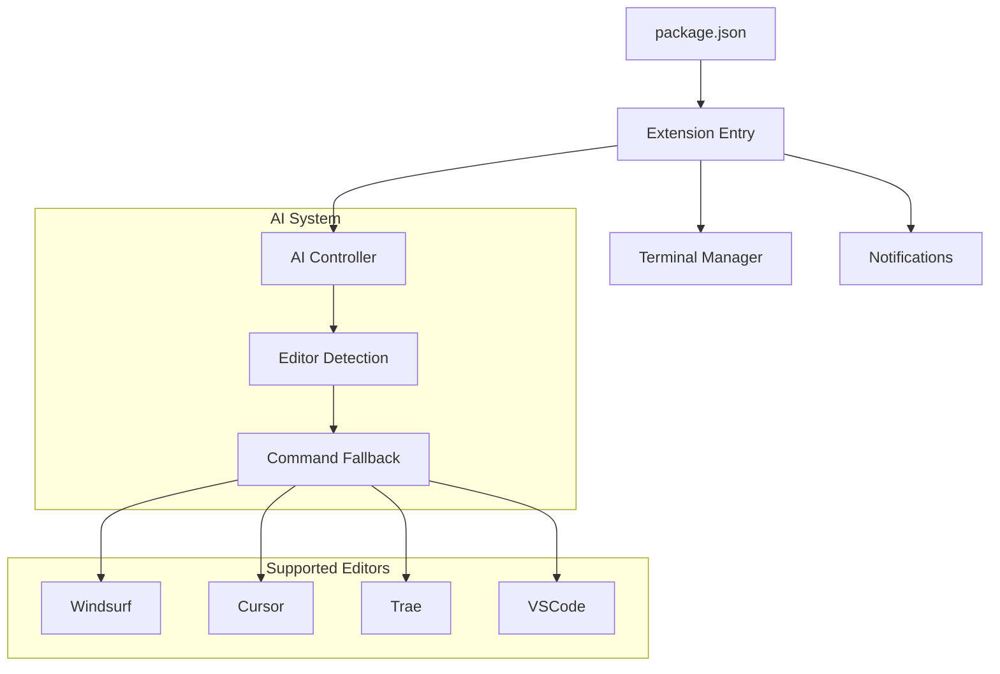

# Lynx Keymap Pro Architecture

## Overview
**Lynx Keymap Pro** is a high-performance extension designed to unify keyboard shortcuts across major AI-powered editors (VS Code, Cursor, Windsurf, Trae, etc.). Optimized for Pro layouts, it provides a seamless developer experience with intelligent AI command fallback.

## Core Architecture

```mermaid
graph TD
    A[package.json] --> B[Extension Entry]
    B --> C[AI Controller]
    B --> D[Terminal Manager]
    B --> E[Notifications]
    
    subgraph "AI System"
        C --> C1[Editor Detection]
        C1 --> C2[Command Fallback]
    end
    
    subgraph "Supported Editors"
        C2 --> Windsurf
        C2 --> Cursor
        C2 --> Trae
        C2 --> VSCode
    end
```

## Project Structure
```text
src/
├── extension.ts              # Entry point & Manager registration
├── keymaps/
│   ├── ai/
│   │   ├── configs.ts        # Editor signatures & AI commands
│   │   └── controller.ts     # Detection & Fallback logic
│   └── terminal/
│       ├── shared.ts         # Panel state & persistence
│       ├── side-panel.ts     # Left/Right toggle logic
│       └── bottom-panel.ts   # Bottom toggle logic
└── notifications/
    ├── info.ts               # Standard notifications
    └── whith-buttons.ts      # Interactive UI alerts
```

## Key Systems

### 🤖 AI Controller
The AI system uses a **Priority-Based Fallback**. It detects the active editor type (e.g., Windsurf vs. Cursor) and maps a single Lynx command (like `lynx.toggleSuggestionAI`) to the specific native command of that editor.

### 📟 Terminal Management
Deterministic terminal toggling that ensures UI stability. It manages panel positions (Left, Right, Bottom) while preserving terminal session state and labels.

### 🔔 Smart Notifications
Centralized system for user feedback, handling everything from simple info messages to complex installation prompts for dependency extensions.

## Essential Shortcuts
| Shortcut | Action |
| :--- | :--- |
| `Ctrl+1/2/3` | Navigation (Explorer/SCM/Ext) |
| `Alt+W/E` | Terminal (Side/Bottom) |
| `Alt+1/2/3` | Git (Stage/Commit/Unstage) |
| `Shift+Alt+D` | Toggle AI Suggestions |
| `Alt+Z` | AI Agent Mode |

---
*Optimized for Pro layouts. Unified across all AI editors.*
